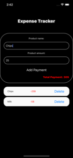

## Expense Tracking App
This project contains a simple React Native application that you can use to track your expenses. The application utilizes Redux for state management.

# Features
- You can track your expenses by categorizing them.
- It calculates the total amount you need to pay at the cashier when shopping or buying multiple items.
You can edit, delete, or add new expenses.

# Technologies
- React Native: The main library used for app development.
- Redux: Employed for global state management.